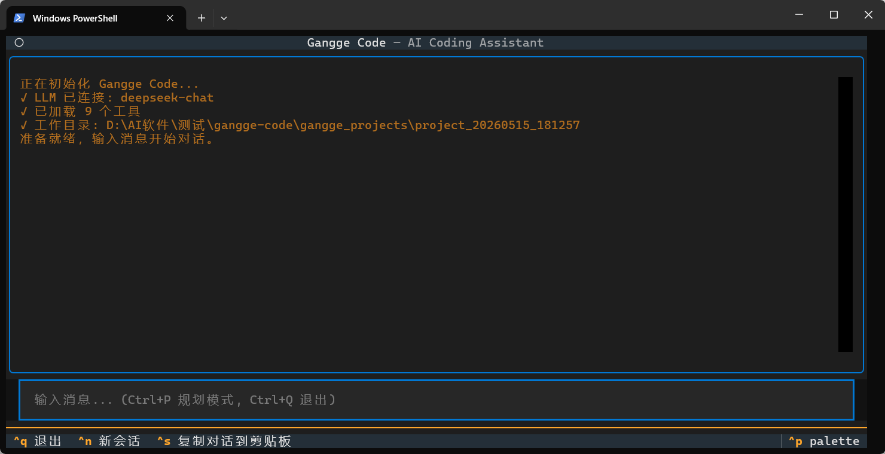

<div align="center">

# ⚡ Gangge Code

**Local AI Coding Assistant — Plan, Execute, Verify, All on Your Machine**

<p align="center">
  
  
  
</p>

**CLI · TUI · Desktop GUI · Interactive REPL**

[English](./README_EN.md) | 中文

> 输入一句话，AI 自动规划模块、逐文件构建、跑测试验证、Git 提交 — 全程可见，随时可控。

</div>

---

## ✨ 特色

| | Gangge Code | ChatGPT / Copilot | Claude Code |
|--|--|--|--|
| 自主调用工具 | ✅ | ❌ 只输出代码 | ✅ |
| 本地完全运行 | ✅ | ❌ | ❌ 需订阅 |
| DeepSeek 原生支持 | ✅ 成本低 10x | ❌ | ❌ |
| 桌面 GUI | ✅ PyQt6 | ❌ | ❌ |
| Shadow Git 回滚 | ✅ | ❌ | ✅ |
| Memory Bank 跨会话 | ✅ | ❌ | ✅ |
| LSP 语法检查 | ✅ | ❌ | ❌ |
| 批量任务队列 | ✅ | ❌ | ❌ |
| MCP 外部工具接入 | ✅ | ❌ | ✅ |
| 完全开源可改 | ✅ | ❌ | ❌ |

---

## 🚀 快速安装

### 1. 克隆项目

```bash
git clone https://github.com/ydsgangge-ux/gangge-code.git
cd gangge-code
```

### 2. 安装（三选一）

```bash
# 方式 A：最小安装（CLI + TUI）
pip install -e .

# 方式 B：带桌面 GUI
pip install -e ".[gui]"

# 方式 C：全部安装（GUI + 开发工具）
pip install -e ".[all]"
```

### 3. 配置 API Key

```bash
cp .env.example .env
# 编辑 .env，填入你的 API Key
```

最小配置（DeepSeek）：
```ini
LLM_PROVIDER=deepseek
DEEPSEEK_API_KEY=sk-xxx
```

### 4. 开始使用

```bash
# 单次任务
gangge "创建一个带用户认证的 FastAPI 项目"

# 交互式 REPL
gangge

# 桌面 GUI（需要安装 [gui]）
python desktop/app.py
# 或 Windows 双击 desktop/run.bat
```

---

## 🎬 运行效果

<p align="center">
  
  <br/>
  <em>桌面端 GUI — 会话管理、代码输出、文件预览</em>
</p>

<p align="center">
  
  <br/>
  <em>AI 自动规划、执行、验证 — 全程可见</em>
</p>

```
📋 任务分析
技术栈：FastAPI + SQLAlchemy + SQLite

✅ 任务清单 (0/6)
1. [ ] 创建项目结构 — app/, routes/, models/
2. [ ] 数据模型层   — models/user.py
3. [ ] 认证模块     — routes/auth.py
...

▶ 开始执行第 1 步
  ▶ bash(mkdir -p app/routes app/models)
  ✓ write_file: 已写入 app/models/user.py (42 行)
✅ 1/6 已完成
```

---

## 🛠️ 核心功能

### Agent 引擎
- **30 轮 Plan & Execute 循环** — 分析 → 调工具 → 看结果 → 继续，直到完成
- **首轮必出规划** — 模块清单 + 任务步骤 + 文件结构
- **ask_user 暂停等待** — AI 需要信息时暂停提问，用户回答后继续
- **测试验证保障** — 文件写完自动运行 pytest，失败自动修复
- **上下文管理** — 滑动窗口 + 工具结果截断 + 文件索引懒加载，节省 Token

### 9 个编程工具
`bash` · `read_file` · `write_file` · `edit_file` · `grep` · `glob` · `list_dir` · `web_fetch` · `ask_user`

### 安全与回滚
- **Shadow Git Checkpoint** — AI 修改前自动创建 Git 检查点，一键回滚
- **LSP 语法检查** — 写完代码自动运行 pyright/ruff 检查，错误即时修复
- **权限控制** — 规则引擎 + 危险检测，系统目录写入自动拦截
- **批判者自检** — System Prompt 内置自检规范，提交前检查语法/逻辑/依赖/风格

### 项目管理
- **Memory Bank** — `.gangge/` 目录跨会话记录项目进度 + 决策日志
- **Decision Log** — 记录"为什么这么做"，防止 AI 重复犯错
- **会话持久化** — SQLite 存储，随时恢复历史会话
- **文件变更 Diff** — 每次修改自动生成 unified diff，绿色新增 / 红色删除

### 四种使用形态

| 形态 | 命令 | 适合场景 |
|------|------|---------|
| **单次执行** | `gangge "任务描述"` | 快速任务，CI/CD |
| **管道模式** | `cat error.log \| gangge "分析"` | 日志分析，Shell 脚本 |
| **交互 REPL** | `gangge` | 多轮对话，持续开发 |
| **桌面 GUI** | `python desktop/app.py` | 完整项目开发，Diff 查看 |

### 桌面 GUI 专属功能
- **VSCode 风格三栏布局** — 左侧(会话+文件) | 中间(聊天+输入) | 右侧(预览+工具)
- **独立文件预览** — 点击文件在右侧面板预览，不污染聊天记录
- **一键停止** — 执行中随时点击红色停止按钮取消任务
- **批量任务队列** — 多行输入，依次自动执行
- **计划确认** — 规划模式下先出方案，你批准后再执行
- **Diff 回滚** — 查看变更 Diff 并一键回滚到修改前状态

### 可扩展性
- **`.ganggerules`** — 项目根目录定义编码规范、测试要求、架构约定
- **MCP 协议支持** — 接入任意 MCP Server（AutoCAD、FreeCAD、数据库、浏览器...）

---

## 📐 架构

```
用户界面层 (Layer 1)
  CLI gangge "任务"  ──┐
  管道 cat x | gangge ─┤
  REPL gangge         ─┤──► AgenticLoop（核心引擎 Layer 3）
  TUI terminal.py     ─┤       │
  GUI desktop/app.py  ─┘       ├─ 工具执行层 (Layer 3 tools)
                               │    bash · file_ops · search · web · ask_user
                               ├─ 会话管理层 (Layer 2)
                               │    持久化 · Memory Bank · 压缩
                               ├─ 权限安全层 (Layer 4)
                               │    规则引擎 · 危险检测 · Shadow Git
                               └─ LLM 适配层 (Layer 5)
                                    DeepSeek · OpenAI · Claude · Ollama
```

---

## ⚙️ 配置

**`.env` 环境变量**

```ini
LLM_PROVIDER=deepseek          # deepseek / openai / anthropic / ollama
DEEPSEEK_API_KEY=sk-xxx
DEEPSEEK_MODEL=deepseek-chat

MAX_ROUNDS=30                  # 最大工具调用轮数
MAX_TOKENS=8192
TEMPERATURE=0.0
```

**`.ganggerules` 项目规则**（放项目根目录）

```markdown
# 编码规范
- 所有注释用中文
- 每个新函数必须写 pytest 测试
- 数据库操作只在 repositories/ 目录
```

---

## 📁 项目结构

```
gangge-code/
├── desktop/
│   ├── app.py              # PyQt6 桌面主程序
│   ├── run.bat             # Windows 一键启动
│   └── run.ps1             # PowerShell 启动
├── src/gangge/
│   ├── cli.py              # CLI 入口
│   ├── cli_repl.py         # 交互式 REPL
│   ├── layer1_ui/          # TUI 界面
│   ├── layer2_session/     # 会话管理（SQLite + Memory Bank）
│   ├── layer3_agent/       # 核心引擎
│   │   ├── loop.py         #   Agentic Loop
│   │   ├── planner.py      #   Plan & Execute 规划器
│   │   ├── prompts/        #   System Prompt
│   │   └── tools/          #   9 个工具 + lint_check
│   ├── layer4_permission/  # 权限安全
│   ├── layer4_tools/       # Shadow Git + MCP Client
│   └── layer5_llm/         # LLM 适配（4 种 provider）
├── tests/
│   └── test_core.py        # 核心模块测试（14 个用例）
├── .env.example            # 环境变量模板
├── pyproject.toml          # 项目配置
└── requirements.txt        # 依赖列表
```

---

## 🧪 测试

```bash
# 运行全部核心测试
pytest tests/test_core.py -v

# 只运行 AgenticLoop 测试
pytest tests/test_core.py -v -k "test_loop"

# 只运行 Windows 兼容测试
pytest tests/test_core.py -v -k "Windows"

# 只运行消息链完整性测试
pytest tests/test_core.py -v -k "TestMessageChain"

# 带覆盖率
pytest tests/test_core.py --cov=src/gangge --cov-report=term-missing
```

---

## 🗺️ Roadmap

- [x] CLI / REPL / TUI / PyQt6 桌面端
- [x] Memory Bank 跨会话上下文 + Decision Log
- [x] Shadow Git 检查点（每步可回滚）
- [x] LSP 语法检查（pyright/ruff/pylint）
- [x] ask_user 暂停等待用户输入
- [x] 上下文管理优化（滑动窗口 + 截断 + 懒加载）
- [x] VSCode 风格桌面 GUI（三栏布局 + 文件预览 + 停止按钮）
- [x] 核心模块测试覆盖
- [ ] 国际化 (i18n) 英语语言包
- [ ] Web UI（远程访问）
- [ ] 向量索引 (RAG) 局部上下文

---

## 🤝 Contributing

欢迎 PR 和 Issue！

如果觉得有用，请点个 ⭐ — 这对项目帮助很大。

---

## 📜 License

MIT © [ydsgangge-ux](https://github.com/ydsgangge-ux)
